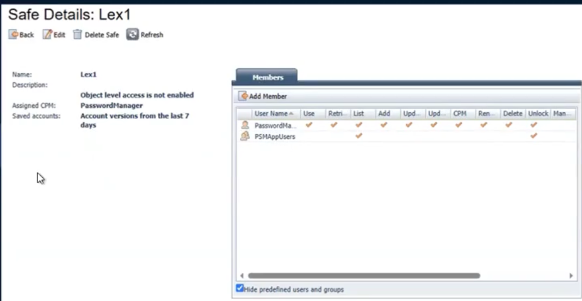

# CyberArk PAM Lifecycle Lab

## Overview
This project demonstrates hands-on experience with CyberArk Privileged Access Management (PAM), focusing on managing privileged accounts across their full lifecycle.

I implemented account onboarding, safe management, credential verification, reconciliation, privileged session access (PSM), and secure account deprovisioning in a controlled lab environment.

## What I Did
- Managed privileged accounts using CyberArk PVWA
- Created and managed Safes to securely store credentials
- Onboarded Windows Server local accounts into CyberArk
- Performed account lifecycle operations:
  - Account onboarding (adding accounts to safes)
  - Credential verification
  - Password reconciliation
  - Secure account deletion
- Established secure privileged sessions via CyberArk PSM, using brokered RDP connections without exposing credentials
- Validated access control and account security states

  
## Key Concepts Demonstrated
- Privileged Access Management (PAM)
- Safe management
- Account lifecycle (Create → Manage → Delete)
- Security and access control

## Screenshots

### 1. Safe Creation & Management

### 2. Account Onboarding

### 3. Account Management View

### 4. Privileged Access via PSM

### 5. Active Session (RDP)

### 6. Account Deletion

