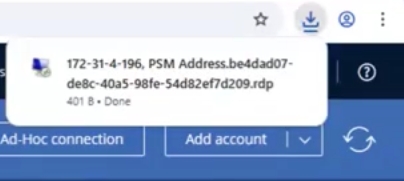
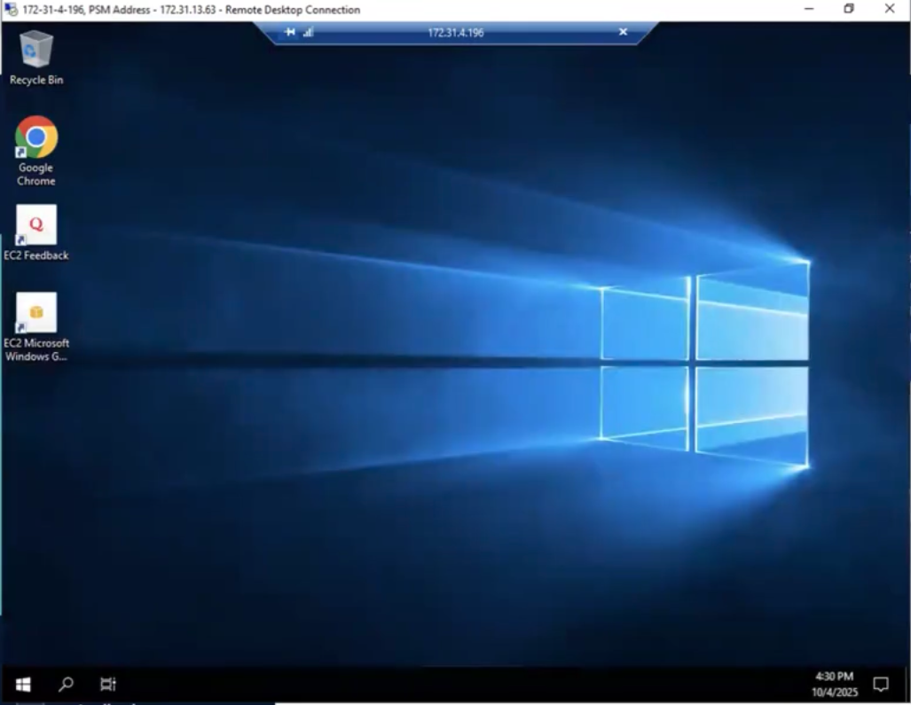
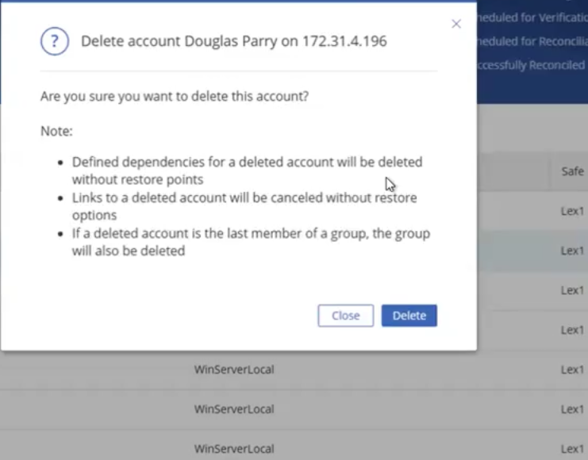

# CyberArk PAM Lifecycle Lab — Privileged Account Onboarding & Session Security

## Overview

This project demonstrates a CyberArk Privileged Access Management workflow, including:

- Creating and managing CyberArk Safes
- Onboarding privileged accounts into the Vault
- Assigning user access to Safes
- Managing privileged sessions through PSM
- Simulating password rotation and account offboarding
- Supporting audit visibility for privileged access activity

## Tools Used

- CyberArk PVWA
- CyberArk Vault
- CPM
- PSM
- Active Directory
- Windows Server
- PowerShell
- CyberArk REST API

## Project Goals

The goal of this lab is to show how privileged accounts can be secured, monitored, and managed using CyberArk PAM.

## Architecture / Workflow

1. Create privileged account in Active Directory
2. Create Safe in CyberArk PVWA
3. Add privileged account to the Safe
4. Assign user permissions and Safe membership
5. Configure CPM for password management
6. Connect to target server through PSM
7. Monitor and record privileged session activity
8. Perform password rotation and verification
9. Offboard account and remove privileged access

Administrator
      |
      v
    PVWA
      |
      v
    Vault
   /     \
 CPM     PSM
  |        |
  v        v
Password  Target
Rotation  Server


## Key Tasks Completed

- Created CyberArk Safe for privileged accounts
- Onboarded Windows/AD privileged account
- Configured Safe member access
- Tested privileged session through PSM
- Reviewed CyberArk audit/session activity
- Documented onboarding and offboarding workflow


## PowerShell & REST API Concepts

Explored CyberArk REST API endpoints for Safe creation, account onboarding, and account retrieval. Demonstrated how PowerShell can interact with CyberArk APIs to support PAM administration and automation workflows.

### Create CyberArk Safe

```powershell
Invoke-RestMethod -Method POST `
-Uri "$PVWAURL/API/Safes" `
-Headers $Headers `
-Body $SafeBody

### Retrieve Accounts

Invoke-RestMethod -Method GET `
-Uri "$PVWAURL/API/Accounts" `
-Headers $Headers

Invoke-RestMethod -Method POST `

-Uri "$PVWAURL/API/Accounts" `

-Headers $Headers `

-Body $AccountBody

```

Key REST API Operations Reviewed

• POST /API/Safes
• GET /API/Accounts
• POST /API/Accounts
• Authentication and token-based API access concepts

## Challenges & Fixes

### 1. Safe Permission Configuration

..

- Issue: Users could not view or access privileged accounts stored in the Safe.
- Fix: Reviewed Safe membership and assigned the required permissions through PVWA.

---

### 2. Platform Assignment During Onboarding

- Issue: Account onboarding failed due to incorrect platform selection.
- Fix: Selected the appropriate Windows platform and validated account properties.

---

### 3. Privileged Session Connection (PSM)

- Issue: Unable to launch an RDP session through PSM.
- Fix: Verified PSM connectivity and confirmed account permissions before reconnecting.

---

### 4. Password Verification & Reconciliation

- Issue: Credential verification failed during account management testing.
- Fix: Reviewed account configuration and corrected credential settings.

---

### 5. Account Offboarding

- Issue: Privileged account remained assigned after deprovisioning.
- Fix: Removed account dependencies and deleted the account from the Safe following least-privilege practices.

---

### 6. CyberArk API Authentication

- Issue: API requests returned authentication errors.
- Fix: Validated API endpoint configuration and authentication headers before retrying requests.


The following screenshots demonstrate the end-to-end CyberArk PAM lifecycle from account
onboarding to secure privileged access and deprovisioning.


## Screenshots

### 1. Safe Creation & Management


---

### 2. Account Onboarding


---

### 3. Account Management View


---

### 4. Privileged Access via PSM



---

### 5. Active Session (RDP)



---

### 6. Account Deletion



Demonstrates secure offboarding of a privileged account in CyberArk, enforcing least privilege by removing dependencies, access links, and group memberships to prevent unauthorized access.

What I Learned

* How CyberArk secures privileged credentials
* How Safes control privileged account access
* How CPM supports password rotation
* How PSM provides session monitoring
* How PAM supports least privilege and audit readiness

Outcome

Successfully simulated a CyberArk PAM lifecycle workflow for privileged account onboarding, secure access, session monitoring, and offboarding.

## Recommendations

- Enforce MFA for privileged users
- Implement regular password rotation through CPM
- Review Safe permissions quarterly
- Monitor privileged sessions through PSM
- Apply least privilege to all privileged accounts

## Reflection

This lab strengthened my understanding of privileged access management, account lifecycle operations, secure session management, and CyberArk administrative workflows. It also reinforced the importance of least privilege and credential protection in enterprise environments.


